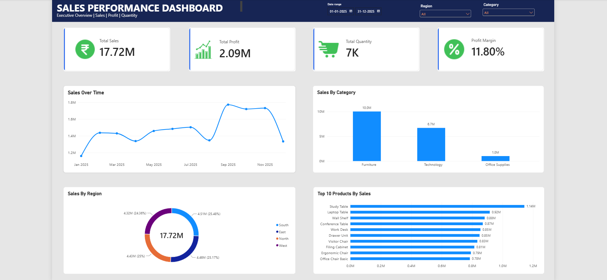

# 📊 Sales Performance Dashboard

## 📌 Project Overview
This project presents an interactive Sales Performance Dashboard built using Power BI.  
The dashboard analyzes sales, profit, quantity, regional performance, product categories, and top-selling products to provide meaningful business insights.

## 🎯 Key KPIs
- Total Sales: 17.72M
- Total Profit: 2.09M
- Total Quantity: 7K
- Profit Margin: 11.80%

## 📈 Dashboard Features
- Sales trend analysis over time
- Sales performance by category
- Regional sales analysis
- Top 10 products by sales
- Date range filtering
- Region filtering
- Category filtering
- Interactive KPI cards

## 🔍 Key Insights
- Furniture is the highest-performing category with approximately 10M in sales.
- Technology generated approximately 6.7M in sales.
- Office Supplies generated approximately 1M in sales.
- Sales are distributed relatively evenly across the four regions.
- Study Table is the highest-selling product at approximately 1.14M.
- Sales reached their highest monthly level around September.

## 🛠️ Tools Used
- Power BI
- Power Query
- DAX
- CSV
- Data Cleaning
- Data Visualization

## 📷 Dashboard Preview

## 📂 Project Files

- `Sales_Data_Analysis_Dashboard.pbix` — Power BI dashboard file
- `Sales_Data_Cleaned_Final.csv` — Cleaned dataset
- `Sales_Performance_Dashboard.png` — Dashboard preview

## 👤 Author

**Ajit Kumar**

Aspiring Data Analyst | Power BI | SQL | Excel | Python
